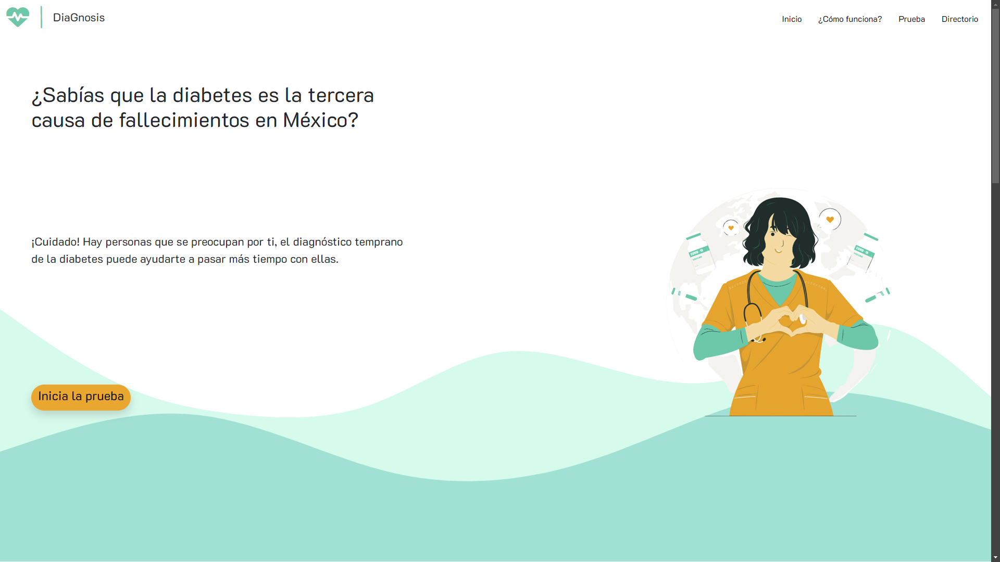
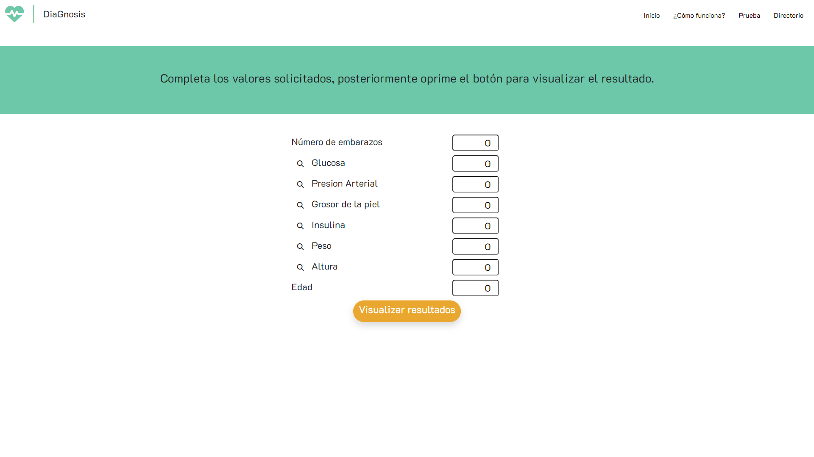
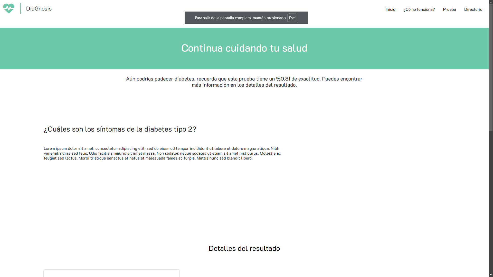
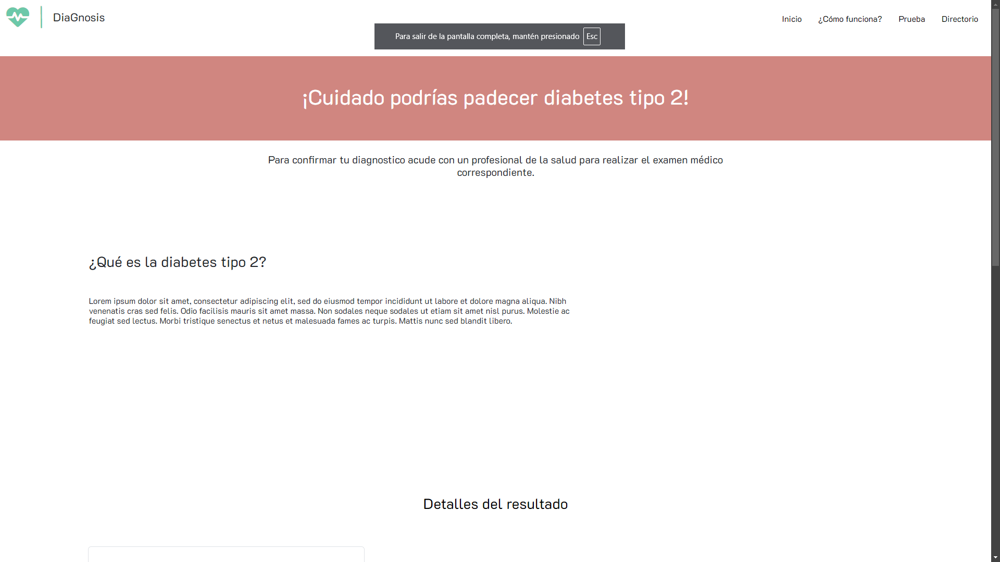

# **Herramienta Web para la Clasificación de Diabetes Mellitus Tipo 2**

## **Descripción**
Este proyecto consiste en el desarrollo de una herramienta basada en inteligencia artificial que permite a los usuarios entre 18 y 60 años, residentes de la Ciudad de México y el Estado de México, evaluar su susceptibilidad a padecer diabetes mellitus tipo 2. A través de un modelo de clasificación implementado en Python y una interfaz web amigable, la herramienta proporciona información valiosa para tomar decisiones informadas sobre la salud.

---

## **Introducción**
Las enfermedades no transmisibles, como la diabetes mellitus tipo 2, son una de las principales causas de mortalidad en México. Muchas personas desconocen su diagnóstico, lo que limita el acceso oportuno a tratamientos adecuados. Este proyecto busca resolver este problema mediante el desarrollo de una plataforma web que utiliza un modelo de inteligencia artificial para identificar usuarios en riesgo.

---

## **Tecnologías Utilizadas**
- **Python**: 
  - Desarrollo del algoritmo de clasificación basado en inteligencia artificial.
  - Implementación del servidor utilizando Flask para gestionar la interacción entre el modelo y la interfaz web.
- **JavaScript**:
  - Control de animaciones y elementos interactivos a través de Bootstrap.
- **Bootstrap**:
  - Diseño responsivo y elementos visuales para mejorar la experiencia del usuario.
- **CSS**:
  - Personalización del estilo y apariencia del sitio web.

---

## **Características del Proyecto**
1. **Evaluación Basada en Inteligencia Artificial**  
   Clasificación de usuarios según factores determinantes de riesgo.
   
2. **Interfaz Web Intuitiva**  
   Página amigable y accesible diseñada con Bootstrap y CSS.

3. **Orientación Médica**  
   Recomendaciones para seguir acciones médicas o hábitos saludables.

4. **Accesibilidad**  
   Disponible desde dispositivos móviles o computadoras con conexión a internet.

---

## **Instalación y Uso**

### **Requisitos Previos**
- Python 3.8 o superior
- Virtualenv (opcional, recomendado)
- Node.js y npm (opcional, para personalizar Bootstrap)

### **Instalación**
1. Clona el repositorio en tu máquina local:
   ```bash
   git clone https://github.com/MunIori/DiaGnosis.git
2. Navega al directorio del proyecto
3. Instala las dependencias necesarias mediante pip o un entorno:
   ```bash
   pip install -r requirements.txt
   conda env create -f environment.yml
4. Inicia la herramienta:
   ```bash
   python servidor.py
## Uso
1. Iniciar la prueba.
2. Introducir los datos solicitados.
3. Se mostrará el resultado de la clasificación sobre diabetes mellitus tipo 2.

## Capturas de Pantalla




